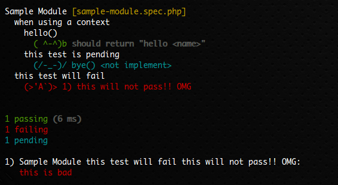

# Peridot PHP Starter Kit

[Peridot](http://peridot-php.github.io/) is a modern testing tool for PHP 5.4+. 

This Project is Starter Kit for Peridot.

## Features

1. Easy installation
2. Comical face reporter (No StackTrace)
3. Easy Code coverage
4. Simple Assert

## Requirements

* PHP 5.4+
* [Composer](https://getcomposer.org/)

## Install

```sh
$ git clone git://github.com/ktty1220/peridot-starter-kit.git
$ cd peridot-starter-kit
$ composer install
$ vendor/bin/peridot --help
```

### Directories

```sh
peridot-starter-kit
  ├─peridot-easy ... peridot customize config libraries
  ├─specs        ... test specs files
  ├─src          ... source files
  └─peridot.php  ... peridot bootstrap script
```

## Using simple StackTrace

### Default 'spec' reporter

```sh
$ vendor/bin/peridot
  this test will fail
    1) this will not pass!! OMG

  1 failing

  1) this will not pass!! OMG:
     this is bad
      #0 <StackTrace> ...
      #1 <StackTrace> ...
      #2 <StackTrace> ...
      #3 <StackTrace> ...
      #4 <StackTrace> ...
      #5 <StackTrace> ...     <= so noisy
      #6 <StackTrace> ...
      #7 <StackTrace> ...
      #8 <StackTrace> ...
          .
          .
          .
```

### 'face' reporter

StackTrace suppressed.

```sh
$ vendor/bin/peridot -r face
```



## How to Code coverage

### Basic

```sh
$ vendor/bin/peridot -r face --coverage-html report
```

Generate coverage report into `report` directory.

> Composer directory(local & global) will be automatically excluded from Code coverage.

### Exclude specified file/directory from Code coverage

```sh
$ vendor/bin/peridot -r face --coverage-html report --coverage-blacklist peridot-easy
```

`vendor` directory will be excluded from coverage report.

> You can use `-B` option instead of `--coverage-blacklist`.

This option can be used more than one times.

```sh
$ vendor/bin/peridot -r face --coverage-html report -B peridot-easy -B peridot.php -B foo -B bar.php
```

### Include specified file/directory to Code coverage

```sh
$ vendor/bin/peridot -r face --coverage-html report -B . --coverage-whitelist src
```

`src` directory only will be included in coverage report.

> You can use `-W` option instead of `--coverage-whitelist`.

## Simple Assert

### Before

```php
use Peridot\Leo\Interfaces\Assert;

describe('example test', function() {
  it('shoud return 1', function() {
    $assert = new Assert();  // <= need "new Assert()" on every test
    $assert->strictEqual(hoge(), 1);
  });
});
```

### After

```php
namespace Peridot\Easy\Test;  // <= use Peridot\Easy\Test namespace

describe('example test', function() {
  it('shoud return 1', function() {
    assert()->strictEqual(hoge(), 1);  // <= no need to call "new Assert()"
  });
});
```

## License

[MIT license](http://www.opensource.org/licenses/mit-license)

&copy; 2015 [ktty1220](mailto:ktty1220@gmail.com)
